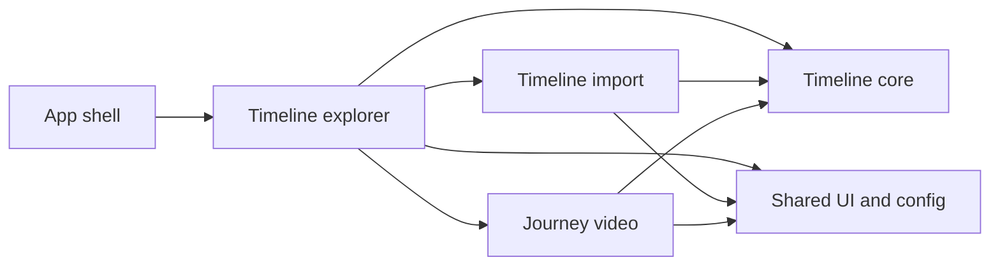

# Project structure

Timeline Map Visualizer uses a framework shell around framework-agnostic Timeline core code and feature-first UI modules.

## Boundaries

- `src/app/` contains only Vinext App Router entry files, metadata, and the global stylesheet aggregator.
- `src/core/timeline/` contains browser- and framework-agnostic event contracts, analytics, parser adapters, and export transforms. Browser downloads are isolated in `export/download.ts`.
- `src/features/` groups code by user capability. A feature may depend on Timeline core and shared modules, but must not reach into another feature's internal files.
- `src/shared/` contains reusable presentation, formatting, and environment configuration without feature state.
- `tests/fixtures/` contains synthetic cross-feature inputs. `tests/e2e/` contains Playwright journeys. Unit and component tests live beside their source as `*.test.ts` or `*.test.tsx`.
- `public/audio/` contains distributable soundtrack assets; `scripts/generate-soundtracks.mjs` is their deterministic generator.

## Imports

- Use `@/*` for imports crossing submodule or feature boundaries. The alias maps to `src/*`.
- Use relative imports inside the same submodule. The import feature uses Vite's relative `?worker` module import so development and static builds receive the same bundled worker URL.
- Import Timeline contracts from `@/core/timeline`, not from internal model or adapter files.
- Import another feature only through its `index.ts`. Feature barrels export entry components and public types only.
- Components must not read `import.meta.env` directly. Environment and map provider values belong in `src/shared/config/`.

## Where new files belong

| Change | Location |
| --- | --- |
| New Timeline source format | `src/core/timeline/parsing/adapters/` |
| Event calculation or filter | `src/core/timeline/model/` |
| CSV or GeoJSON transform | `src/core/timeline/export/` |
| Import lifecycle or worker protocol | `src/features/timeline-import/` |
| Explorer screen or filter UI | `src/features/timeline-explorer/` |
| Journey playback, recording, or rendering | `src/features/journey-video/` |
| Reusable formatter, config, or brand primitive | `src/shared/` |

Keep barrels narrow and dependencies one-directional so circular imports remain visible during review.
